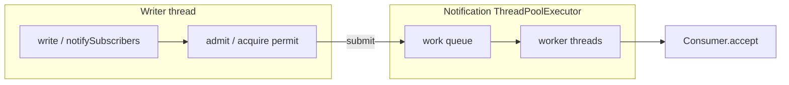

# Plan 01: Abstract ledger notification hot-path (snapshot + backpressure)

## Goals

- Remove **per-event** subscriber-list copying in `AbstractLedger.notifySubscribers` to cut allocations and lock hold time on the write/notify path.
- Preserve **async** notification: subscriber `Consumer` bodies **never** run on the ledger writer thread (Phase 1 choice **1A**).
- When the notification executor is saturated, **block producers** until there is capacity (Phase 4 choice **4B**) **without** `CallerRunsPolicy` (which would run work on the caller).
- Defer deeper “eliminate `submit` allocation” work unless profiling shows it dominates after the snapshot fix (Phase 4 choice **1A** follow-on).

## Context & Scope

**Problem:** `notifySubscribers` currently builds `new ArrayList<>(subscribers)` under `subscriberLock` on **every** record (`AbstractLedger.java` ~153–157). Under high event rates this allocates heavily on the hot path. Separately, each `executor.submit(…)` allocates task objects; user hypothesis is that snapshot removal is the first win, with `submit` as a possible second phase **only if** evidenced.

**Scope:** `simple-utilities` module, `tech.rsqn.useful.things.ledger` — primarily `AbstractLedger`. Callers (`MemoryLedger`, `WriteBehindMemoryLedger`, `DiskLedger`, `WriteBehindDiskLedger`, `StreamReader`) remain behavior-compatible except where explicitly tightened (backpressure: reject → block).

**Environments:** Any consumer of this library (backtest, services). No new external services.

## Non-Goals & Boundaries

- **Not in scope:** Switching to virtual-thread executors (Phase 4 **3A**); programme/stakeholder governance artifacts.
- **Not in scope (this release):** Eliminating `Runnable`/`FutureTask` allocations from `submit` unless follow-up profiling warrants it (Phase 4 **1A**).
- **Not in scope:** `Ledger` API extension for `unsubscribe` (commented desire exists in `StreamReader.java`; no interface method today — `Ledger.java` ~39–45).
- **Explicit:** A subscriber registered **concurrently** with an in-flight `notify` may **miss that single record**; all **subsequent** writes must be observed (Phase 4 **2A**). Document in Javadoc.

## Interrogation Record — **MANDATORY**

| # | Question (as asked) | User answer | Confidence (0.0–1.0) | Open / follow-up? |
|---|---------------------|-------------|----------------------|-------------------|
| 1 | Thread model (1A–C) | **1A** — always off writer; reduce alloc/pool overhead only | 0.95 | None |
| 2 | Subscriber weight (2A–C) | **2B** — mixed; some block/I/O; isolate from writer | 0.9 | None |
| 3 | Ordering (3A–C) | **3C** — parallel delivery OK; visibility after write matters | 0.9 | None |
| 4 | Subscribe during run (4A–C) | **4C** — rare; prefer safe snapshot pattern | 0.85 | Document miss-one-event edge case |
| 5 | Success metric (5A–C) | **5A** — fewer allocations / GC on writer thread | 0.95 | Optional JFR after Phase 1 |
| 6 | Follow-on if `submit` still hot (1A–C) | **1A** — stop at snapshot for release; revisit with profiling | 0.9 | None |
| 7 | Concurrent subscribe vs same event (2A–B) | **2A** — OK to miss that notification round | 0.9 | None |
| 8 | Executor strategy (3A–C) | **3A** — keep `ThreadPoolExecutor` knobs | 0.95 | None |
| 9 | Queue full policy (4A–C) | **4B** — block writer until space | 0.9 | **Must not** use `CallerRunsPolicy` |
| 10 | Plan file location (5A–C) | **5A** — root `plans/` + `tasks.md` **## Active** | 1.0 | None |

### Record hygiene

- **Interrogation Record:** Q&A audit only.
- **Assumption ledger:** derived beliefs; scores in **Assumption Ledger** and footer.

---

## SDLC — Requirements & discovery

### Functional requirements

- **FR-1:** `subscribe` continues to register `(filter, subscriber)`; snapshot visible to `notifySubscribers` without copying the mutable list on every event.
- **FR-2:** Notifications for a given record may run **concurrently** across subscribers (3C); errors in one subscriber must not prevent others (existing `LOG.log` behavior preserved).
- **FR-3:** If notification work is saturated, **writers block** until capacity exists (4B), and **subscriber code still runs only on pool threads** (1A).

### Non-functional requirements (performance, reliability, accessibility, i18n, etc.)

- **NFR-1:** Reduce hot-path allocations from per-event `ArrayList` copy to **zero** in steady state (snapshot read only).
- **NFR-2:** Bounded memory behavior: blocking admission prevents unbounded task buildup **beyond** executor queue + active threads capacity (existing bounds, made strict via admission).
- **NFR-3:** No silent notification loss on saturation: **reject** behavior replaced by **block** (behavior change — document in changelog / Javadoc for integrators).

### Requirements traceability (brief: requirement → design → test hook)

| Req | Design | Test hook |
|-----|--------|-----------|
| FR-1 | `volatile List` snapshot + `List.copyOf` on `subscribe` | Unit: subscriber still invoked; concurrent subscribe test |
| FR-3 | Semaphore (or equivalent) admission **before** `submit`; release on task completion | Integration: saturated pool + write blocks then completes |
| 4B/1A reconcile | No `CallerRunsPolicy`; writer blocks on **admit**, not on **run** | Assert writer thread never invokes `Consumer.accept` |

## SDLC — Architecture & design

### Context & component view



### Interfaces & contracts (APIs, events, schemas)

- **`Ledger.subscribe`** unchanged (`Ledger.java`).
- **Semantic clarification (Javadoc on `subscribe` / `notifySubscribers`):** a subscriber added **during** dispatch may not receive the **current** record; it **will** receive later writes (user **2A**).

### Data model & persistence

- No persistence schema changes.

### Design decisions & trade-offs

| Decision | Rationale | Downside |
|----------|-----------|----------|
| Volatile immutable snapshot | Lock-free read on hot path; `List.copyOf` only on `subscribe` | One extra indirection; rare subscribe pays small copy |
| Block writers when saturated | User **4B**; aligns with not dropping notifications | Write latency under slow subscribers; risk of deadlock if subscriber synchronously waits on writer |
| Keep `ThreadPoolExecutor` | User **3A** | `submit` allocations may remain |
| No `CallerRunsPolicy` | Would violate **1A** (subscriber on writer) | Requires explicit admission control |

**Admission control (implemented):** custom `RejectedExecutionHandler` that performs `executor.getQueue().put(r)` when the pool would otherwise abort. This blocks the **submitting** thread until queue space exists, without `CallerRunsPolicy` (subscriber bodies never run on the writer). A counting `Semaphore` was **not** used: its capacity is easy to mismatch with `ThreadPoolExecutor`’s internal saturation rules (reject happens when queue is full **and** no new thread can be added), so blocking `put` stays aligned with the executor.

## SDLC — Implementation & build

### Implementation strategy & milestones

1. Snapshot field + `subscribe` maintenance; `notify` reads snapshot only.
2. Admission / blocking policy; remove reliance on default abort-on-reject for steady-state expectation.
3. Tests + verification + documentation.

### Key modules / packages / files

- `simple-utilities/src/main/java/tech/rsqn/useful/things/ledger/AbstractLedger.java` — primary.
- Tests: `LedgerSubscriberTest`, `LedgerConcurrencyTest`; add focused test for **blocking when saturated** and **concurrent subscribe**.

### Feature flags, migrations, backward-compat stance (per project rules)

- **Breaking behavior change:** saturated notification path **blocks** instead of rejecting (`RejectedExecutionException`). Per `no-backwards-compatibility.mdc`, acceptable unless external API guarantees reject; **document** in release notes.
- No feature flag required unless integrators need old behavior (out of scope).

## SDLC — Testing & quality assurance

### Test strategy by layer

- **Unit:** Snapshot visibility; empty snapshot fast path; filtered subscribers unchanged.
- **Integration:** Multi-threaded writes + slow subscriber; assert **no lost** notifications when writer would previously race reject (use small queue + blocking subscriber).
- **Regression:** Existing `LedgerSubscriberTest` / `LedgerConcurrencyTest` pass.

### Test environments & data

- Local Maven / CI; existing `LedgerTestBase` patterns.

### Entry / exit criteria for test gates

- **Entry:** Plan approved (this document) + **Go** on expert review (workflow).
- **Exit:** All targeted module tests green; new tests cover admission blocking and concurrent subscribe semantics.

## SDLC — Security & compliance

### Threats & mitigations

- **Deadlock:** Subscriber calls back into same ledger on same thread ordering — **mitigate** by documenting “do not synchronously wait on ledger from subscriber”; optional future timeout on admit (out of scope unless needed).

### Secrets & configuration

- None.

### Compliance / policy checkpoints

- N/A — internal library performance change.

## SDLC — Documentation & knowledge transfer

### Developer documentation

- Javadoc on snapshot semantics, blocking policy, and “miss current event on concurrent subscribe.”

### Operator / support documentation

- N/A unless operators tune `setNotificationQueueCapacity` / pool sizes — note latency vs blocking tradeoff.

## SDLC — Build, CI/CD & release management

### Build & artifact layout

- Maven reactor; `simple-utilities` JAR.

### CI/CD stages & gates

- Existing pipeline; `mvn test` for affected module.

### Release type (major/minor/patch) & communication

- **Minor or patch** per semver interpretation of behavioral tightening (blocking vs reject). Maintainer decides version bump.

## SDLC — Deployment & environments

### Environment matrix

- Consumer applications pull new `simple-utilities` version.

### Deployment procedure & sequencing

- Standard library publish; consumers rebuild.

### Rollback procedure (first-class)

- Revert dependency version; restore prior `AbstractLedger` behavior.

## SDLC — Operations, monitoring & observability

### Monitoring & alerting

- Optional follow-up: JFR allocation samples on `notifySubscribers` post-change (user **5A** evidence).

### Operational dashboards & health checks

- Existing `healthCheck` reports `subscriberCount`; no change required unless new metrics added later.

## SDLC — Maintenance, incidents & support

### Support model & escalation

- Library maintainer (per `pom.xml` developer metadata).

### Incident response & postmortem hooks

- If deadlocks reported after deploy, triage subscriber re-entrancy vs admission.

### Maintenance & deprecation plan

- If `unsubscribe` is added later, snapshot must update on removal as well (single place to maintain).

---

## Applied Rules

- `plan-first`, `question-formatting`, `confidence-scoring`, `definition-of-done`, `devils-advocate`, `expert-review` (planning workflow).
- `architectural-decomposition` — change stays in ledger infrastructure layer.
- `prove-it-first` — tests before or with behavior change for blocking/admission.
- `execution-safety` — no blind casts; preserve exception logging in subscribers.
- `no-backwards-compatibility` — document reject→block semantic change.
- `no-tick-drop` — **interpretation:** notification tasks must not be **silently discarded** when saturated; blocking satisfies “no drop” for this path (contrast with `DiscardPolicy`).

## Related Documents

| Document | Role | Link |
|----------|------|------|
| Ledger metrics (Micrometer alignment) | Sibling plan in `plans/` | [01-ledger-metrics-micrometer-alignment.md](01-ledger-metrics-micrometer-alignment.md) |
| Ledger write-behind hardening | Backlog tracker in `tasks.md` | [tasks.md § Ledger: memory / write-behind hardening](../tasks.md) |

## Dependencies & third parties

| Dependency | Version / constraint | Purpose | Risk |
|------------|---------------------|---------|------|
| JDK | From `rsqn-oss-super-pom` | `java.util.concurrent`, `List.copyOf` | Low — verify if any consumer still on pre-Java-10 (no `List.of` / `copyOf`) |

## Master Task List (engineering)

- [ ] Add `volatile` subscriber snapshot + `List.copyOf` on `subscribe`; initialize empty snapshot.
- [ ] Update `notifySubscribers` to read snapshot without per-event `new ArrayList<>(subscribers)`.
- [ ] Implement producer admission so saturated executor **blocks** writers without `CallerRunsPolicy`.
- [ ] Javadoc: concurrent subscribe, blocking policy, reject→block change.
- [ ] Tests: concurrent subscribe; saturated executor blocking; regression suite green.
- [ ] Optional: JFR before/after note in PR description.

## User Review Required

> [!IMPORTANT]
> - **Behavior change:** full notification executor → **blocks writers** instead of `RejectedExecutionException` (default abort). Confirm semver and consumer expectations.
> - **Tasks gatekeeper:** root `tasks.md` may still fail automated ConsumerAgentSuite until `standards/` + schema-aligned tracker exist — process follow-up independent of this code change.
> - **Re-entrancy:** blocking admission can interact badly if subscriber **synchronously** waits on a write to the same ledger; document and avoid.

## Implementation Phases (delivery slices)

### Phase 1: Volatile subscriber snapshot

- **Proposed changes (files / services):** `AbstractLedger.java` — `subscriberSnapshot` field; `subscribe` updates; `notifySubscribers` uses snapshot read; fast path if empty.
- **Testing & acceptance:** Extend / add unit tests for subscribe + notify; concurrent `subscribe` during writes (statistical or barrier-based).
- **Security / compliance notes:** None.
- **Rollback:** Revert commit; restore per-event copy.

### Phase 2: Blocking admission under saturation

- **Proposed changes:** `AbstractLedger` — semaphore (or vetted equivalent) + wrapped tasks; **do not** use `CallerRunsPolicy`.
- **Testing & acceptance:** Integration test: tiny queue, slow subscriber, multiple writes — assert all notifications eventually delivered; writer blocks (use timeout + order assertions).
- **Security / compliance notes:** Avoid unbounded wait without interrupt policy — align with existing interrupt handling on write path where applicable.
- **Rollback:** Revert Phase 2 only if split commits; else full revert.

### Phase 3: Verification & handoff

- **Proposed changes:** Javadoc polish; optional JFR screenshot or allocation counters in test-only harness (not required for merge if tests suffice).
- **Testing & acceptance:** Full `simple-utilities` test module; manual smoke if consumer app available.
- **Security / compliance notes:** None.
- **Rollback:** N/A (docs-only / evidence).

## Critical Path Tests

1. `LedgerSubscriberTest` — still passes (async delivery).
2. **New:** concurrent `subscribe` + writes — no `ConcurrentModificationException`; semantics per **2A**.
3. **New:** saturated notification pool — writer **blocks** then all events notified; **no** `RejectedExecutionException` in steady state.
4. `LedgerConcurrencyTest` — still passes (event count).
5. Filtered subscription — unchanged behavior (`LedgerSubscriberTest.testFilteredSubscribe`).
6. **Regression:** health check / close shutdown still sane with in-flight notifications.

## Verification Plan

### Build & run orchestration

| Action | Command | Notes |
|--------|---------|-------|
| Build | `mvn -pl simple-utilities -am package -DskipTests` | From repo root |
| Test | `mvn -pl simple-utilities test` | From repo root |
| Run / start | N/A — library module | N/A |
| Lint / static analysis | As configured in parent POM / CI | Follow existing pipeline |

### Automated tests (by type)

- **Unit / integration:** `mvn -pl simple-utilities test` (TestNG).

### Manual / UAT

- Optional: run consumer backtest with JFR before/after Phase 1 (user-driven).

### Evidence index (plan-local)

| ID | Type | Location / command | Expected |
|----|------|-------------------|----------|
| E1 | Automated | `mvn -pl simple-utilities test` | All green |
| E2 | Optional | JFR allocation hot spots | `notifySubscribers` alloc reduced post-snapshot |

## Assumption Ledger

| Assumption | Confidence (0.0–1.0) | Evidence to upgrade | If false, impact |
|------------|------------------------|---------------------|------------------|
| `List.copyOf` / immutable snapshot API available on consumer JDKs | 0.85 | Consumer matrix | Need different copy-on-subscribe strategy |
| Blocking `put` on reject matches TPE saturation without extra counting | 0.9 | `LedgerSubscriberTest.testNotificationBackpressureDeliversAllEvents` | Revisit if executor type changes |
| Subscribers do not synchronously block on same ledger write | 0.7 | Code review in consumers | Deadlock risk under Phase 2 |
| `submit` alloc remains significant only after snapshot removed | 0.65 | JFR | Phase 3 follow-up scope |

## Risk Register

| # | Phase / area | Risk | Impact | Proximity | Mitigation | Action detail |
|---|--------------|------|--------|-----------|------------|---------------|
| 1 | Phase 2 | Writer blocking increases latency | High under slow I/O subscribers | Near | Tune queue/pool; document | Load-test guidance |
| 2 | Phase 2 | Deadlock subscriber ↔ ledger | High if pattern exists | Medium | Document; optional timeout | Consumer audit |
| 3 | Phase 1 | Miss-one-event on concurrent subscribe confuses tests | Medium | Medium | Javadoc + targeted test | Clarify in PR |
| 4 | Release | Semver disagreement on blocking vs reject | Medium | Near | Release note | Maintainer call |

## Confidence Score (mandatory — gating)

```
Confidence: 88% (High)
Basis: User interrogation complete; code locations confirmed (`AbstractLedger`, `Ledger`); Devil’s Advocate choices recorded; 4B reconciled with 1A via admission control (not CallerRuns).
Assumptions:
  - JDK provides `List.copyOf` for all supported consumers (0.85 — verify consumer baseline).
  - Semaphore permit count matches ThreadPoolExecutor saturation model (0.75 — validate in implementation + tests).
  - No subscriber re-entrancy that waits on same ledger under pool saturation (0.70 — document; escalate if violated in production).
```
