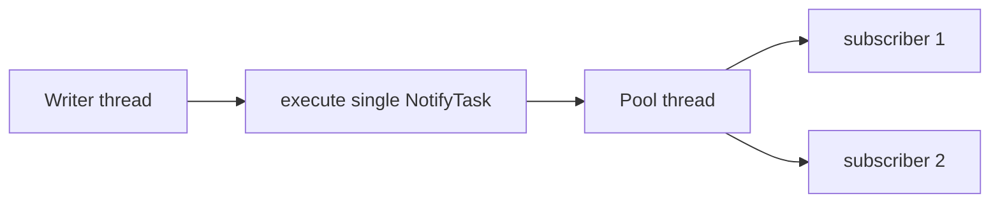

# Plan 02: Ledger notification fan-in (single dispatch per record)

## Goals

- Reduce **per-event** notification overhead beyond Plan 01 by cutting **`ExecutorService.submit`** fan-out (**one call per matching subscriber** today — see `AbstractLedger.notifySubscribers`, ~177–195).
- Prefer **`execute`** over **`submit`** where no `Future` is needed, avoiding **`FutureTask`** allocation per dispatch.
- Preserve **async** delivery: subscriber bodies still run **only** on the notification pool (never `CallerRunsPolicy` on the writer).
- Preserve existing **backpressure**: custom `RejectedExecutionHandler` with blocking **`BlockingQueue#put`** remains valid for saturated pools.

## Context & Scope

**Today (after Plan 01):** `notifySubscribers` reads a **volatile immutable snapshot** (no per-event list copy). It still loops matching subscribers and calls **`executor.submit(() -> sub.accept(record))`** for each — so **K matching subscribers ⇒ K task objects** (lambda + `FutureTask` machinery) per record.

**This plan:** Dispatch **one runnable per record** that iterates the snapshot and invokes each matching subscriber **serially on a single pool thread**, OR introduce a **configurable** policy if parallel fan-out must remain opt-in.

**Module:** `simple-utilities`, `AbstractLedger` and tests; no `Ledger` interface signature change required.

## Non-Goals & Boundaries

- **Not in scope:** LMAX Disruptor / per-subscriber dedicated queues / object pools (possible Plan 03 if profiling still shows hotspots).
- **Not in scope:** Virtual-thread executor switch (explicitly deferred earlier); can be revisited separately.
- **Not in scope:** `unsubscribe` API.
- **Default semantic change:** Subscribers for the **same record** run **serially** in snapshot order unless we add an **opt-in parallel** mode (see Design decisions).

## Interrogation Record — **MANDATORY**

| # | Question (as asked) | User answer | Confidence (0.0–1.0) | Open / follow-up? |
|---|---------------------|-------------|----------------------|-------------------|
| 1 | Parallel delivery of the **same** record across subscribers required? | **Assumption:** serial on one pool thread is acceptable (matches prior **3C** “parallel OK” — not “required”). | 0.75 | Confirm before merge if any consumer relied on parallel `accept` for one record |
| 2 | Opt-in parallel mode needed? | **Assumption:** no — single policy (fan-in) unless review objects | 0.7 | Add `setNotificationFanOutParallel(boolean)` only if needed |

### Record hygiene

- Assumption ledger below captures beliefs not duplicated here.

---

## SDLC — Requirements & discovery

### Functional requirements

- **FR-1:** Every matching subscriber is still invoked **once** per written record (same as today).
- **FR-2:** Exceptions in one subscriber must not prevent later subscribers in snapshot order from running (same isolation as today’s per-task `try/catch`).
- **FR-3:** Writer thread never executes `Consumer.accept` (retain **1A** from prior discovery).

### Non-functional requirements

- **NFR-1:** Fewer allocations on the writer thread: **O(1)** executor interactions per record (not O(subscribers)).
- **NFR-2:** No increase in silent notification loss vs current `shutdown` / interrupted `put` behavior.

### Requirements traceability

| Req | Design | Test |
|-----|--------|------|
| FR-1 | Single task loops snapshot, applies filters | Existing + multi-subscriber count test |
| FR-3 | Only `execute`/`submit` from writer; runnable runs on pool | No new `CallerRunsPolicy` |
| NFR-1 | One `execute` per record | Micro-benchmark optional; allocation story in PR |

## SDLC — Architecture & design

### Context & component view



### Interfaces & contracts

- **`Ledger.subscribe`** unchanged.
- **Javadoc update:** Clarify that for a given record, subscribers are notified **in snapshot order** on **one** pool thread (no parallel `accept` for that record unless optional mode added).

### Design decisions & trade-offs

| Decision | Rationale | Downside |
|----------|-----------|----------|
| Fan-in serial per record | Cuts executor queue pressure and `FutureTask` count | Long-running subscriber delays others for **same** record |
| `execute` not `submit` | Avoids `Future` | Must not rely on `Future` for backpressure metrics (none today) |
| Keep blocking `put` handler | Same saturation semantics as Plan 01 | Unchanged |

**Optional future:** `boolean parallelFanOut` restoring current loop+`execute` per subscriber — only if a consumer proves they need parallelism for CPU work per record.

## SDLC — Implementation & build

### Implementation strategy

1. Replace the per-subscriber loop in `notifySubscribers` with **one** `executor.execute(() -> dispatch(record, snapshot))` where `dispatch` applies filters and `accept` in order with per-subscriber `try/catch`.
2. Add **fast path:** `snapshot.size() == 1` and filter passes → still use single `execute` (same code path, JIT may inline).
3. **Prove:** tests for 0 / 1 / N subscribers; exception in middle subscriber does not skip later ones.

### Key files

- `simple-utilities/src/main/java/tech/rsqn/useful/things/ledger/AbstractLedger.java`
- `simple-utilities/src/test/java/tech/rsqn/useful/things/ledger/LedgerSubscriberTest.java` (and/or concurrency tests)

### Backward compatibility

- **Observable behavior change:** parallel `accept` for the same record → **serial**. Document in changelog; semver per maintainer (likely **minor** if any consumer depended on parallelism).

## SDLC — Testing & quality assurance

### Test strategy

- **Unit:** Multiple subscribers, verify call counts and order (if order asserted, match snapshot add order).
- **Unit:** Second subscriber runs after first throws (mock first throws).
- **Regression:** `LedgerSubscriberTest`, `LedgerConcurrencyTest`, Plan 01 backpressure test still pass (may need timing tweaks if serial changes latency).

### Entry / exit criteria

- **Exit:** `mvn -pl simple-utilities test` green; Javadoc updated.

## SDLC — Security & compliance

- **Threat:** Long subscriber work blocks subsequent subscribers for that record — operational, not security.
- No secrets / PII changes.

## SDLC — Documentation & knowledge transfer

- Javadoc on `notifySubscribers` / class doc: serial per-record dispatch.
- PR / release note: **parallelism removed** unless optional flag added.

## SDLC — Build, CI/CD & release management

- Standard Maven module publish; CI runs existing Surefire.

## SDLC — Deployment & environments

- Library version bump consumed by applications.

## SDLC — Operations, monitoring & observability

- Optional: JFR before/after to confirm `FutureTask` / `submit` hot spot reduction.

## SDLC — Maintenance, incidents & support

- If a consumer needs parallel fan-out, evaluate optional mode or revert pattern for that deployment only.

---

## Applied Rules

- `plan-first`, `prove-it-first`, `architectural-decomposition`, `no-backwards-compatibility` (document breaking semantic where applicable), `execution-safety`, `java-synchronization` (no external calls under `subscriberLock`).

## Related Documents

| Document | Role | Link |
|----------|------|------|
| Plan 01 — snapshot + blocking handler | Prior delivery | [01-abstract-ledger-notification-hot-path.md](01-abstract-ledger-notification-hot-path.md) |
| Ledger metrics | Sibling | [01-ledger-metrics-micrometer-alignment.md](01-ledger-metrics-micrometer-alignment.md) |

## Dependencies & third parties

| Dependency | Version / constraint | Purpose | Risk |
|------------|---------------------|---------|------|
| JDK | Same as parent POM | `ExecutorService.execute` | Low |

## Master Task List (engineering)

- [x] Refactor `notifySubscribers` to single `execute` per record with internal dispatch loop.
- [x] Replace `submit` with `execute` on that path.
- [x] Javadoc + release note on serial vs former parallel fan-out.
- [x] Tests: multi-subscriber, failure isolation, regression suite.
- [ ] Optional: JFR screenshot or allocation note in PR.

## User Review Required

> [!IMPORTANT]
> Confirm no integrator **requires** parallel `accept` across subscribers for the **same** record. If yes, add opt-in parallel mode or defer this plan.

## Implementation Phases (delivery slices)

### Phase 1: Fan-in dispatch + `execute`

- **Changes:** `AbstractLedger.notifySubscribers` — one `execute`, private `dispatchNotify` method.
- **Testing:** New / extended unit tests for order and failure isolation.
- **Rollback:** Revert commit.

### Phase 2: Docs & evidence

- **Changes:** Javadoc, changelog; optional JFR.
- **Testing:** Full module tests.
- **Rollback:** Docs-only revert.

### Phase 3: Optional parallel mode (only if required)

- **Changes:** Flag + restored multi-`execute` path.
- **Testing:** Both modes covered.
- **Rollback:** Remove flag.

## Critical Path Tests

1. Two subscribers, one record — both invoked once.
2. First subscriber throws — second still invoked.
3. Filtered multi-subscriber — only matching invoked.
4. `testNotificationBackpressureDeliversAllEvents` (Plan 01) — still passes.
5. `LedgerConcurrencyTest` event totals — unchanged.

## Verification Plan

### Build & run orchestration

| Action | Command | Notes |
|--------|---------|-------|
| Build | `mvn -pl simple-utilities -am package -DskipTests` | Repo root |
| Test | `mvn -pl simple-utilities test` | Repo root |
| Run / start | N/A | Library |

### Evidence index (plan-local)

| ID | Type | Location / command | Expected |
|----|------|-------------------|----------|
| E1 | Automated | `mvn -pl simple-utilities test` | Green |
| E2 | Optional | JFR alloc profile | Fewer `FutureTask` on notify path |

## Assumption Ledger

| Assumption | Confidence (0.0–1.0) | Evidence to upgrade | If false, impact |
|------------|------------------------|---------------------|------------------|
| Serial `accept` per record is acceptable | 0.75 | Stakeholder sign-off | Add parallel option or abort plan |
| `execute` is available on all targeted JDKs | 0.95 | Parent POM | N/A |

## Risk Register

| # | Phase / area | Risk | Impact | Proximity | Mitigation |
|---|--------------|------|--------|-----------|------------|
| 1 | Phase 1 | Head-of-line blocking across subscribers | Latency | Near | Document; keep work small in subscribers |
| 2 | Release | Hidden dependency on parallel fan-out | Correctness perception | Medium | Release note + optional flag |

## Confidence Score (mandatory — gating)

```
Confidence: 82% (High)
Basis: Current code path is known (`AbstractLedger.notifySubscribers`); fan-in is a standard pattern; main risk is product assumption on parallel per-record delivery.
Assumptions:
  - No requirement for parallel invocation of subscribers for the same record (0.75 — confirm with consumers).
  - Blocking `put` handler remains sufficient for backpressure (0.85 — unchanged from Plan 01).
```
