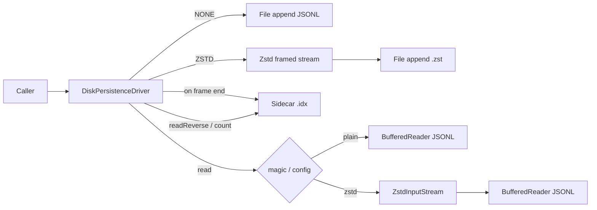

# Plan 04: Disk ledger optional streaming Zstd compression

## Goals

Add **opt-in, streaming Zstandard (zstd) compression** to `DiskPersistenceDriver` in `simple-utilities` so callers can append JSONL records continuously under compression without changing the record schema. Default remains **uncompressed plain JSONL**. Forward read, reverse read, and `count()` must be correct under ZSTD via a **sidecar index**. Clean **shutdown/`close()`** must finish the current zstd frame and flush durable state.

## Context & Scope

High-volume ledgers (especially order-book snapshots) produce multi‑GB/day JSONL. Empirically JSONL + zstd yields ~15–20× size reduction. Compression must work for **continuous live writes** (multi-frame append), not only offline archives.

**In scope (this PR):** `DiskPersistenceDriver` (+ supporting types in the ledger package), Maven optional `zstd-jni`, unit/integration tests (TestNG), brief README/Javadoc.

**Users:** Library consumers constructing `DiskPersistenceDriver` directly (e.g. pysol). `LedgerRegistry` continues to create uncompressed `.jsonl` drivers unless callers build the driver themselves.

**Environments:** JVM 21; platforms supported by `zstd-jni` natives when ZSTD is enabled.

**Constraints:** Additive API only on `PersistenceDriver`; payload remains JSONL inside frames; no default-on compression.

## Non-Goals & Boundaries

- No JSON schema / record type changes
- No protobuf/parquet
- No default-on compression
- No `LedgerRegistry` filename/extension auto-wiring in this plan (caller-owned paths; recommend `.jsonl.zst` in docs)
- No offline recompress migration tool in-tree (document CLI `zstd` for existing files)
- No changes to failover/S3 wrapper modules beyond transparent driver behavior
- No pure-Java compressor path (JNI `zstd-jni` chosen)

## Interrogation Record — **MANDATORY**

| # | Question (as asked) | User answer | Confidence (0.0–1.0) | Open / follow-up? |
|---|---------------------|-------------|----------------------|-------------------|
| 1 | Reverse read + `count()` under ZSTD design | **A** Sidecar index; fail loud if missing/corrupt after rebuild attempt rules | 0.95 | No |
| 2 | Who uses disk `readReverse` / `count`? | **B** Production paths — must work under ZSTD day one | 0.95 | No |
| 3 | Compressor stack | **A** `zstd-jni` (JNI) | 0.95 | No |
| 4 | Config surface & naming | **A** Explicit setters only; path caller-owned; docs recommend `.jsonl.zst` | 0.95 | No |
| 5 | PR scope | **A** `DiskPersistenceDriver` + tests + short docs only | 0.95 | No |
| 6 | Maven scope for `zstd-jni` | **B** optional/`provided`-style — consumer declares dep; fail fast at `start()` if ZSTD selected and unavailable | 0.9 | Pin exact Maven `optional` vs `provided` in impl (use `optional=true`) |
| 7 | Sidecar file naming | **A** Sibling `foo.jsonl.zst.idx` | 0.95 | No |
| 8 | Index crash consistency | **A** Update index only after successful frame end + OS flush; may lag; reopen may rebuild from complete frames | 0.9 | Rebuild fails if any truncated frame (see Q11) |
| 9 | Truncated trailing frame on read | **B** Fail whole `read` with IOException (later confirmed strict) | 0.95 | No |
| 10 | Build/test command | **A** `mvn -pl simple-utilities test` | 0.95 | No |
| 11 | Truncated vs rebuild contradiction | **A** Strict: truncated/corrupt frame → entire read/count/start-rebuild fails IOException | 0.95 | No |
| 12 | ZSTD + `autoFlush=true` | **A** Document: prefer `autoFlush=false` + batch flush; frame-end on flush; **cleanly handle shutdown** | 0.9 | Shutdown semantics explicit in design |
| 13 | Unstarted write fallback under ZSTD | **A** Throw `IllegalStateException` if write when not started | 0.95 | No |
| 14 | Draft plan after DA? | **A** Yes | 1.0 | No |
| 15 | Index on-disk format | **A** Custom binary (magic + version + fixed-width entries) | 0.95 | No |
| 16 | Maven wiring | **A** `optional=true` + explicit test-scope dep | 0.95 | No |
| 17 | Docs location | **B** ledger package README + root README pointer | 0.95 | No |
| 18 | Implement? | **A** Go | 1.0 | No |

### Record hygiene

- Interrogation Record: Q&A audit only (above).
- Assumption ledger: derived beliefs below.

---

## SDLC — Requirements & discovery

### Functional requirements

1. Default compression = `NONE` (uncompressed JSONL), behaviorally identical to today.
2. Opt-in `ZSTD` via additive setters on `DiskPersistenceDriver` (and/or small config type).
3. Write path: serialize Gson JSON + `\n` → stream into zstd compressor → append frame bytes to file.
4. On flush / close: flush compressor, **end current zstd frame**, flush underlying stream; then update sidecar index.
5. Restart append: open file append, **new** compressor / new frames after existing complete frames (never continue a half-written frame).
6. Forward `read`: detect zstd (config and/or magic `28 B5 2F FD`), decompress transparently, parse JSONL unchanged.
7. `readReverse` and `count`: use sidecar index; never scan compressed bytes as JSONL newlines.
8. Truncated/corrupt frame: **fail entire** read/count/rebuild with `IOException` (no silent skip).
9. ZSTD write before `start()`: **`IllegalStateException`** (no one-shot uncompressed fallback into a zstd file).
10. Clean shutdown: `flush()` and `close()` must finish the open frame and persist index so a subsequent process can read without truncate errors.

### Non-functional requirements

- Stable memory for long-running append (streaming; no whole-file recompress).
- Default zstd level **3**; configurable 1–19 (document ≥10 as archive-oriented).
- Frame flush aligned with existing flush intervals + max uncompressed byte threshold (default ~1 MiB).
- Thread-safety: preserve serialize-outside-lock / write-under-`fileLock` pattern where practical.
- Optional native dependency: NONE users must not require natives at runtime if ZSTD classes are lazily referenced.
- Fail fast at `start()` when ZSTD selected and `zstd-jni` cannot load.

### Requirements traceability (brief)

| Requirement | Design | Test hook |
|-------------|--------|-----------|
| Opt-in ZSTD write/read | Compressing write stream + decompressing read | Round-trip equality vs NONE |
| Multi-frame append/restart | Frame end on flush; new compressor on start | Multi-frame + reopen append test |
| Reverse + count | Sidecar `.idx` | Explicit reverse/count tests |
| Truncate fail-loud | No salvage on corrupt tail | Synthesized truncated file → IOException |
| Clean shutdown | close ends frame + index | Kill compressor state after close; reopen reads all |
| Optional dep | Maven `optional` + lazy holder | NONE tests without asserting native; ZSTD tests need dep on test classpath |
| No unstarted ZSTD write | Guard in `write` | Expect `IllegalStateException` |

## SDLC — Architecture & design

### Context & component view



### Interfaces & contracts (APIs, events, schemas)

**Additive API on `DiskPersistenceDriver` (illustrative):**

- `setCompression(LedgerCompression compression)` — `NONE` (default) | `ZSTD`
- `setZstdLevel(int level)` — default 3; validate 1–19
- `setZstdFrameFlushBytes(int bytes)` — default 1_048_576
- Javadoc `@param` / `@throws` on setters and `start()`

**`PersistenceDriver` interface:** unchanged method signatures.

**New types (package-local or public as needed):**

- `LedgerCompression` enum
- Sidecar index reader/writer (e.g. `ZstdLedgerIndex`) — binary or simple length-prefixed format documented in Javadoc
- Lazy `ZstdSupport` / holder class so NONE path does not initialize natives

**File naming (convention, not enforced):**

- Uncompressed: `*.jsonl`
- Compressed: `*.jsonl.zst`
- Index: `*.jsonl.zst.idx` (sibling of ledger path + `.idx`)

### Data model & persistence

**Ledger body:** concatenation of complete zstd frames; each frame’s uncompressed payload is JSONL (UTF-8 lines ending in `\n`).

**Sidecar index (v1):** maps logical record ordinal → `(compressedFrameFileOffset, uncompressedOffsetWithinFrame)` (or equivalent sufficient for reverse iteration and count). Updated **only after** successful frame end + underlying flush. Record count stored or derived from entry count.

**Recovery:**

- On `start()` with ZSTD: if index missing/stale vs file length, attempt rebuild by decompressing **complete** frames only.
- If truncated/incomplete trailing frame detected → **`IOException`** (strict); do not start writers that would append past corruption without operator intervention (document: truncate/repair offline).

### Design decisions & trade-offs

| Decision | Choice | Trade-off |
|----------|--------|-----------|
| Compressor | `zstd-jni` | Natives required when ZSTD on; best streaming/format compatibility |
| Dep scope | Maven `optional=true` | Consumers must declare dep; test module declares it for ZSTD tests |
| Reverse/count | Sidecar index | Extra file + rebuild complexity; required for production correctness |
| Truncate policy | Fail whole read | Harsh vs salvage; avoids silent partial views |
| autoFlush + ZSTD | Document prefer batch flush; still frame-end on flush | Poor ratio if autoFlush left true |
| Shutdown | Always end frame + flush + index on `flush`/`close` | Clean reopen after orderly stop |
| Unstarted write | IllegalStateException under ZSTD | Removes silent corruption path |

## SDLC — Implementation & build

### Implementation strategy & milestones

Horizontal layers: (1) config/types + optional dep wiring, (2) write/flush/close framed path + shutdown, (3) read + magic detect, (4) sidecar index + reverse/count, (5) tests + docs. TDD: failing tests first per `prove-it-first` / `test-driven-development`.

### Key modules / packages / files

- `simple-utilities/pom.xml` — optional `com.github.luben:zstd-jni` (+ test scope assurance)
- `…/ledger/DiskPersistenceDriver.java` — compression hooks, write/read/count/reverse, shutdown
- `…/ledger/LedgerCompression.java` (new)
- `…/ledger/ZstdLedgerIndex.java` (new) or similar
- `…/ledger/ZstdNativeSupport.java` (new, lazy load)
- `…/ledger/*Zstd*Test.java` (new TestNG tests)
- `README.md` (short ledger compression section) and/or package Javadoc

### Feature flags, migrations, backward-compat stance

- Compression is opt-in config (feature flag equivalent).
- Uncompressed ledgers unchanged (breaking-change default: none).
- No automatic migration of existing `.jsonl` → `.zst`.
- Per `no-backwards-compatibility`: no shims for old APIs; additive only.

## SDLC — Testing & quality assurance

### Test strategy by layer

- **Unit:** index encode/decode; magic detection; config validation; IllegalStateException when ZSTD write without start.
- **Integration (temp files):** round-trip ZSTD vs NONE; multi-frame flush/reopen append; flush durability; size reduction on repetitive JSONL; reverse + count; truncated file → IOException; concurrent write+flush under `fileLock` does not corrupt frames.
- **NONE regression:** existing ledger TestNG suite remains green.

### Test environments & data

- Temp directories; synthetic repetitive JSONL for ratio assert; truncated byte splice for fail-loud test.
- CI must resolve optional `zstd-jni` for tests (declare test dependency explicitly if needed).

### Entry / exit criteria for test gates

- Entry: tests written red then green (TDD).
- Exit: `mvn -pl simple-utilities test` green; Critical Path Tests below pass.

## SDLC — Security & compliance

### Threats & mitigations

| Threat | Mitigation |
|--------|------------|
| Native library load / supply chain | Pin known Maven Central version; optional so unused by default |
| Decompression bomb | Document trust boundary: ledger files are local operator-controlled; rely on zstd frame limits where available; no network ingest in driver |
| Path traversal | Existing Path-based API; no new user string paths beyond caller Path |

### Secrets & configuration

Not applicable — no secrets; compression level is non-sensitive config.

### Compliance / policy checkpoints

GPL-3 project license; `zstd-jni` BSD-2 — document in Dependencies. No PII-specific handling change (records unchanged).

## SDLC — Documentation & knowledge transfer

### Developer documentation

- README section: when to enable; level guidance; `.jsonl.zst` + `.idx`; crash/append; **clean shutdown required**; autoFlush recommendation; truncate fail-loud; optional Maven dep snippet; offline migration via CLI `zstd`.
- Javadoc on setters/`start()`/`close()`.

### Operator / support documentation

- If process killed mid-frame: file may be unreadable until repaired/truncated offline.
- Prefer orderly `close()` / JVM shutdown hooks at app layer.

## SDLC — Build, CI/CD & release management

### Build & artifact layout

- Module JAR `simple-utilities`; optional dep not transitive.

### CI/CD stages & gates

- Existing Travis/CI Maven test; ensure ZSTD tests run with dependency present.

### Release type (major/minor/patch) & communication

- **Minor** (additive API + optional dep). Call out reverse/count sidecar and truncate policy in release notes / PR description.

## SDLC — Deployment & environments

### Environment matrix

| Env | Notes |
|-----|-------|
| Dev/test | Temp files; zstd-jni on test classpath |
| Consumer prod | Declare optional dep when enabling ZSTD; OS/arch must match embedded natives |

### Deployment procedure & sequencing

Library publish only — no server deploy. Consumers bump version and opt in.

### Rollback procedure (first-class)

- Revert to prior library version; leave `.zst` files as-is (older code cannot read them — operators keep uncompressed or use CLI).
- Config rollback: set compression NONE and new file path (do not append NONE to `.zst`).

## SDLC — Operations, monitoring & observability

### Monitoring & alerting

Not applicable for library core — consumers may log IOException on truncate. Driver uses `java.util.logging` warnings for index rebuild attempts (success/fail).

### Operational dashboards & health checks

Not applicable — library module. N/A justified: no runtime service.

## SDLC — Maintenance, incidents & support

### Support model & escalation

Maintainer triage via GitHub issues; include compression mode, level, autoFlush, and whether `.idx` present.

### Incident response & postmortem hooks

Corrupt/truncated `.zst`: fail-loud IOException; offline truncate to last good frame or restore from backup; rebuild index only from complete frames.

### Maintenance & deprecation plan

Index format version field for future evolution; bump if incompatible. No deprecation of NONE path.

---

## Applied Rules

- `plan-first`, `question-formatting`, `confidence-scoring`, `substantive-action-confidence-gate`
- `devils-advocate`, `expert-review` (plan phase; code review after impl)
- `definition-of-done`, `prove-it-first`, `test-driven-development`, `test-definitions`
- `architectural-decomposition`, `no-stubs`, `no-backwards-compatibility` (additive API; no compat shims)
- `execution-safety` / startup: `start()` fail-fast for native load when ZSTD
- `java-performance` (hot path: avoid per-record frame end when batching; lock discipline)
- `use-golang` N/A — Java library module

## Related Documents

| Document | Role | Link |
|----------|------|------|
| Plan 03 Histogram | Prior numbered plan (unrelated feature) | [03-histogram-custom-boundaries.md](03-histogram-custom-boundaries.md) |
| Tasks tracker | Active registration | [../tasks.md](../tasks.md) |

## Dependencies & third parties

| Dependency | Version / constraint | Purpose | Risk |
|------------|---------------------|---------|------|
| `com.github.luben:zstd-jni` | Pin latest stable 1.5.7-x at implement time | Streaming zstd | Native load / platform; optional |
| Existing Gson (provided) | unchanged | JSONL serialize | None new |

## Master Task List (engineering)

- [ ] Add optional `zstd-jni` + test classpath wiring in `simple-utilities/pom.xml`
- [ ] Add `LedgerCompression` + config setters/Javadoc
- [ ] Lazy native support + fail-fast `start()` when ZSTD
- [ ] ZSTD write/flush/close framed path; forbid unstarted ZSTD write
- [ ] Sidecar index write on frame end; rebuild rules (strict truncate)
- [ ] Forward read with magic/config detect
- [ ] `readReverse` + `count` via index only under ZSTD
- [ ] TestNG suite for Critical Path Tests (TDD)
- [ ] README + PR description (API decisions)
- [ ] Expert review on diff; DoD self-assessment

## User Review Required

> [!IMPORTANT]
> - **Native optional dependency** (`zstd-jni`) when ZSTD enabled — consumers must declare it.
> - **Strict truncate policy:** crash mid-frame can make the ledger unreadable until offline repair.
> - **autoFlush=true + ZSTD** yields poor ratios (documented); apps should batch flush but **must** still call orderly `close()`/`flush()` for clean frame end.
> - Sidecar `.idx` is a second file operators must back up with the ledger for reverse/count without rebuild cost (rebuild still attempted when lagging).

## Implementation Phases (delivery slices)

### Phase 1: Config, optional dependency, NONE safety
- **Proposed changes:** `pom.xml`; `LedgerCompression`; setters; lazy Zstd holder; `start()` fail-fast; ZSTD unstarted write → `IllegalStateException`; NONE path untouched.
- **Testing & acceptance:** config validation tests; NONE existing tests green; ZSTD start without dep fails fast (simulate if feasible).
- **Security / compliance notes:** pin version; optional transitive isolation.
- **Rollback:** revert commits; no on-disk format yet if aborted before Phase 2 writes.

### Phase 2: Streaming write, flush, clean shutdown
- **Proposed changes:** framed `ZstdOutputStream` (or compress ctx) under write lock; frame end on flush/close/byte threshold; update index after durable flush; clean shutdown ends frame even if `autoFlush` was true.
- **Testing & acceptance:** multi-frame write; flush then reopen; close durability; ratio assert; write+flush concurrency smoke.
- **Security / compliance notes:** none beyond deps.
- **Rollback:** delete `.zst`/`.idx` test artifacts; revert write-path changes.

### Phase 3: Read, reverse, count, docs
- **Proposed changes:** decompressing forward read; magic detect; index-backed reverse/count; truncated → IOException; README/Javadoc.
- **Testing & acceptance:** Critical Path Tests complete; `mvn -pl simple-utilities test` green.
- **Security / compliance notes:** document trust model for decompress.
- **Rollback:** consumers stay on NONE; remove docs if reverting feature.

## Critical Path Tests

1. Round-trip N records ZSTD ↔ equality with NONE path contents (logical records).
2. Multi-frame: write, flush/frame-end, write more, close, reopen append, write more → full forward read OK.
3. Truncated tail frame → forward `read` throws `IOException` (no partial silent success).
4. Default NONE byte/behavior regression (existing suite + spot check).
5. After `flush()`/`close()`, reopen reads all flushed records; index `count` matches.
6. Repetitive JSONL compressed size &lt; uncompressed size.
7. `readReverse` order + `count` under ZSTD with sidecar present; missing/corrupt index rebuild or fail per strict rules.

## Verification Plan

### Build & run orchestration

| Action | Command | Notes |
|--------|---------|-------|
| Build | `mvn -pl simple-utilities -am package -DskipTests` | Module JAR |
| Test | `mvn -pl simple-utilities test` | TestNG via Surefire |
| Run / start | N/A — library; exercise via tests / consumer `start()` | Driver `start()` fail-fast covered in tests |
| Lint / static analysis | Existing project defaults | No new linter mandated |

### Automated tests (by type)

- Unit + file integration under `src/test/java/.../ledger/` (TestNG).
- Command: `mvn -pl simple-utilities test`.

### Manual / UAT

- Optional: compress a sample day of order books offline vs live driver sample; confirm CLI `zstd -d` can decode multi-frame file.

### Evidence index (plan-local)

| ID | Type | Location / command | Expected |
|----|------|-------------------|----------|
| E01 | executable_check | `mvn -pl simple-utilities test` | Exit 0 |
| E02 | golden_artifact | temp `.jsonl.zst` + `.idx` in tests | Round-trip + reverse/count |
| E03 | doc_reference | README compression section | Matches truncate + shutdown + optional dep |

## Assumption Ledger

| Assumption | Confidence (0.0–1.0) | Evidence to upgrade | If false, impact |
|------------|------------------------|---------------------|------------------|
| Maven `optional=true` + test-scoped explicit dep is enough for CI ZSTD tests | 0.85 | Confirm Surefire classpath in impl | Add test dependency block |
| Lazy holder prevents NONE `NoClassDefFoundError` | 0.85 | Load driver NONE without zstd on classpath in a test if feasible | Restructure packages |
| Index rebuild can detect incomplete trailing frame reliably | 0.8 | zstd-jni error on truncated stream | Tune detection; always fail loud |
| Callers will orderly `close()` in production | 0.75 | App shutdown hooks (consumer) | Truncate incidents rise |
| `ZstdOutputStream` close/end-frame semantics match multi-frame append needs | 0.8 | Spike in Phase 2 | Use lower-level compress ctx API |

## Risk Register

| # | Phase / area | Risk | Impact | Proximity | Mitigation | Action detail |
|---|--------------|------|--------|-----------|------------|---------------|
| R1 | Read | Crash mid-frame strands ledger (strict policy) | High | High | Docs + clean shutdown | Emphasize `close()`; app shutdown hooks |
| R2 | Deps | Consumer enables ZSTD without declaring dep | Medium | Medium | Fail fast at `start()` | Clear exception message + README snippet |
| R3 | Index | Index lag after crash | Medium | Medium | Rebuild from complete frames; fail if truncate | Phase 3 tests |
| R4 | Perf | autoFlush=true destroys ratio | Medium | High | Document batch flush | README + Javadoc |
| R5 | Write | Unstarted fallback corruption | High | Low after fix | IllegalStateException | Phase 1 test |
| R6 | Compat | Magic vs config mismatch | Low | Low | Prefer magic on read; explicit config wins for write | Document |

## Confidence Score (mandatory — gating)

```
Confidence: 88% (High)
Basis: Interrogation complete; DA contradictions resolved (strict truncate, document autoFlush, clean shutdown, unstarted write throws); template filled; touchpoints known in DiskPersistenceDriver; residual risk is index format details and zstd-jni frame-end API spike during Phase 2.
Assumptions:
  - optional zstd-jni + lazy load works for NONE consumers (0.85 — verify in Phase 1)
  - Clean close/flush always yields complete trailing frame when process exits orderly (0.9 — implement + test)
  - Strict truncate IOException is acceptable operationally (0.95 — user locked 1A)
  - Sidecar .idx sufficient for production reverse/count (0.85 — design + tests in Phase 3)
```
